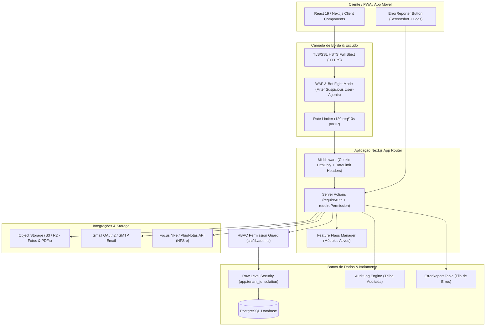
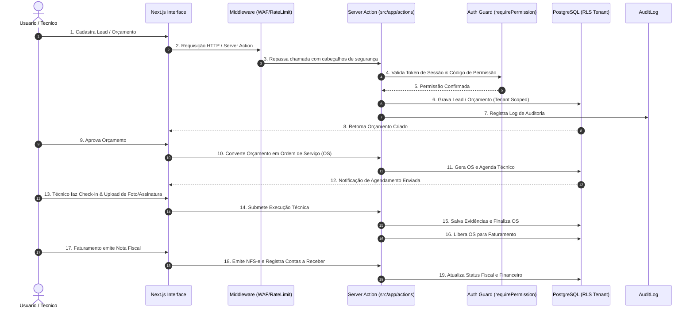
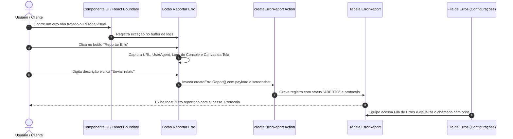
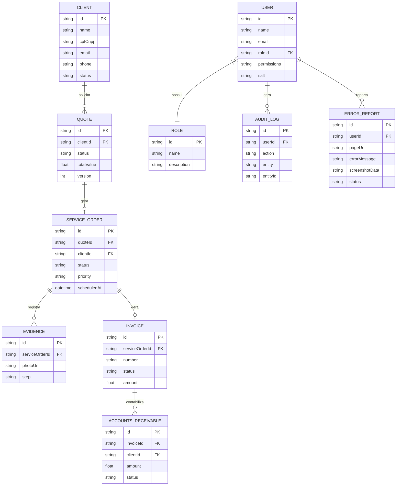

# Mapa do Sistema e Diagramas UML — Nexus ERP (Slide 3/14)

Este documento detalha o mapa de arquitetura, diagrama de sequências e modelo de entidade-relacionamento (ER / UML) do sistema Nexus ERP, descrevendo como os componentes conversam entre si e como as requisições navegam desde o navegador/PWA até o banco de dados.

---

## 1. Arquitetura Geral de Componentes (WAF, Middleware, RBAC e DB)

---

## 2. Diagrama de Sequência — Ciclo de Vida do Negócio (Lead → Orçamento → OS → Execução → Faturamento → Financeiro)

---

## 3. Diagrama de Sequência — Reporte Global de Erros (Slide 9/14)

---

## 4. Diagrama de Entidades & Relacionamentos (UML / ERD)

